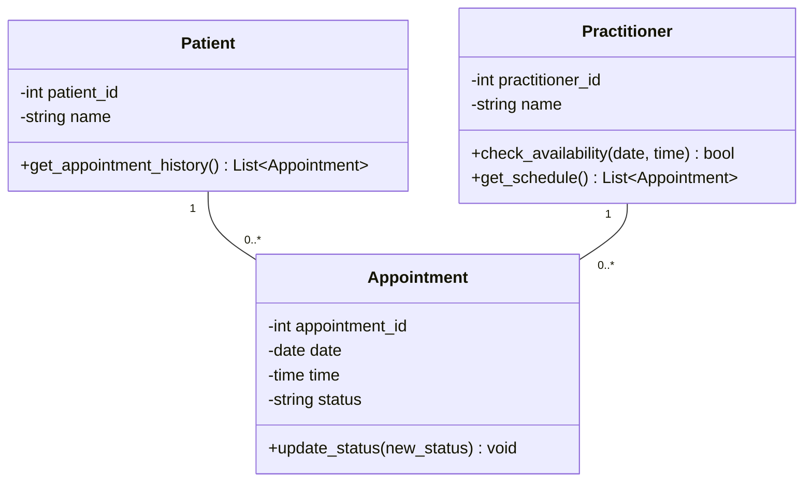

# SmartCare v0.3 - Domain Model Workbook

## Requirement to Concept Trace

| Requirement | Concept | State/behaviour | Decision |
| :--- | :--- | :--- | :--- |
| **FR-01:** System shall enable Staff to Create, Edit, and Save Patient Profiles. | Patient | **State:** patient_id, name, contact_details. **Behaviour:** update_profile() | Accepted (Core Entity) |
| **FR-08:** System shall enable Management to Create, Edit, and Archive Practitioner Profiles. | Practitioner | **State:** practitioner_id, name, specialization, is_archived. **Behaviour:** archive_profile() | Accepted (Core Entity) |
| **FR-03:** System shall enable Staff to make New Appointments by linking Patient to a specific Practitioner. | Appointment | **State:** appointment_id, date, time. **Behaviour:** create_appointment() | Accepted (Core Transaction) |
| **FR-04:** System shall ommit the Creation of any Appointments with the same Practitioner on the same Date and Time. | Practitioner / Appointment | **Behaviour:** check_availability() | Accepted (Business Rule) |
| **FR-05:** System shall enable Staff Members to Update the Status of An Appointment (Scheduled, Completed or Cancelled). | Appointment | **State:** status. **Behaviour:** update_status() | Accepted (Modifies State) |
| **FR-06:** System shall Save and Display all Cancelled and Completed Appointments in the Patient's Appointment History Section. | Patient | **Behaviour:** get_appointment_history() | Accepted (Required Operation) |
| **FR-07:** System shall allow Practitioners to Arrange and View a list of their upcoming schedule. | Practitioner | **Behaviour:** get_schedule() | Accepted (Required Operation) |

## CRC Cards

**Patient**

| Responsibilities | Collaborators |
| :--- | :--- |
| Know about the Personal Details (Name, ID) | Appointment |
| Retrieve Personal Appointment History | |

**Practitioner**

| Responsibilities | Collaborators |
| :--- | :--- |
| Know about the Professional Details (Name, ID) | Appointment |
| Verify their Availability in Schedule for any given Time Slot | |
| Fetch Daily/Weekly Assigned Schedule | |

**Appointment**

| Responsibilities | Collaborators |
| :--- | :--- |
| Know about the scheduled Date and Time | Patient |
| Know about the Current Appointment Status (e.g, Scheduled, Cancelled or Completed) | Practitioner |
| Connect a particular Patient to a specific Practitioner | |

**Optional Class: Reminder (Provisional)**

| Responsibilities | Collaborators |
| :--- | :--- |
| Know about Message Content and Trigger Date | Appointment |
| Send SMS or Email based on Appointment Dates | |

## UML Class Diagram and Design Rationale

**Relationships:**
*   **Patient to Appointment:** 1 to 0..* (A Patient might be having zero or many Appointments) (A single appointment only belongs to exactly one patient).
*   **Practitioner to Appointment:** 1 to 0..* (A Practitioner might be having zero or many Appointments) (A single appointment only belongs to exactly one Practitioner).

**Design Rationale:**
The classes were selected based on the nouns from the functional requirements to avoid overengineering. (Patient, Practitioner, Appointment). The responsibility between classes was appropriately distributed, for instance, the Appointment Class is fully responsible for its own status changes and the Practitioner Class is responsible for its availability status instead of a central controller(FR-04). The Connections and Relationships were established to illustrate simple association between the Transaction entity, which is the Appointment, and physical entities (Patient and Practitioner).

## AI Design Review Record

| AI suggestion | Evidence | Decision | Reason | Model change |
| :--- | :--- | :--- | :--- | :--- |
| Create a ClinicController Class which manages all Bookings. | None (No FR mentions a Controller). | Rejected | Overengineering. It Breaks Object Oriented Rules by unifying the logic rather than distributing it. | None |
| Add a one-to-many relationship between the Practitioner and the Appointment. | FR-07 (View Upcoming Schedule of Appointments). | Accepted | Practitioners have to be scheduled with multiple appointments in order to create a schedule. | Multiplicity defined as 1 to 0..* in UML. |
| Add Billing and Payment Classes. | None | Rejected | Explicitly listed it as "Out of Scope" in the v0.2 Requirements Specification. | None |
| Give the Appointment class an update_status() method. | FR-05 (Update Status). | Accepted | Directly fulfills the requirements of changing an appointment to Scheduled, Cancelled, or Completed. | Added update_status() to Appointment Class. |
| Create an SMSManager Class. | Provisional Requirement (Reminders). | Modified | Suffixes like Manager represent Architecture and not any concepts of domain. | Added Reminder as a Provisional Optional Class instead. |
